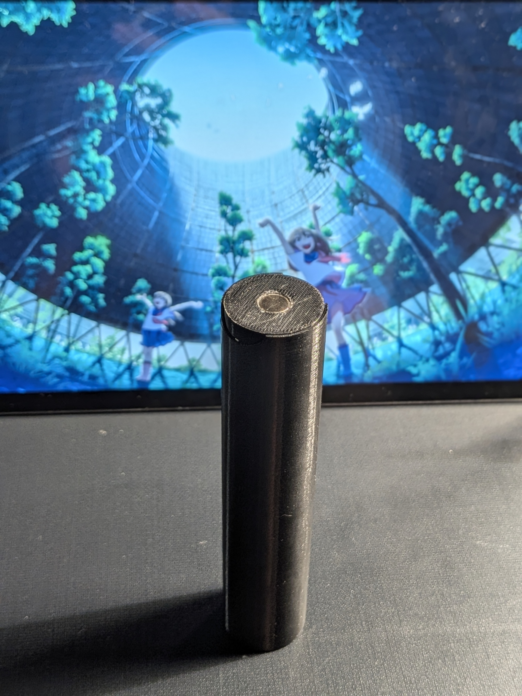
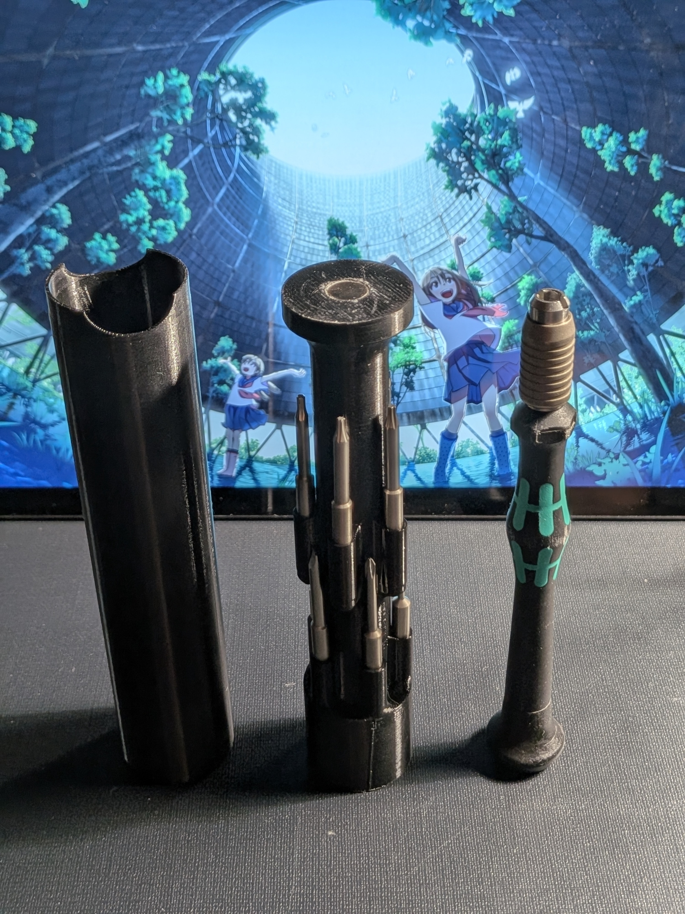
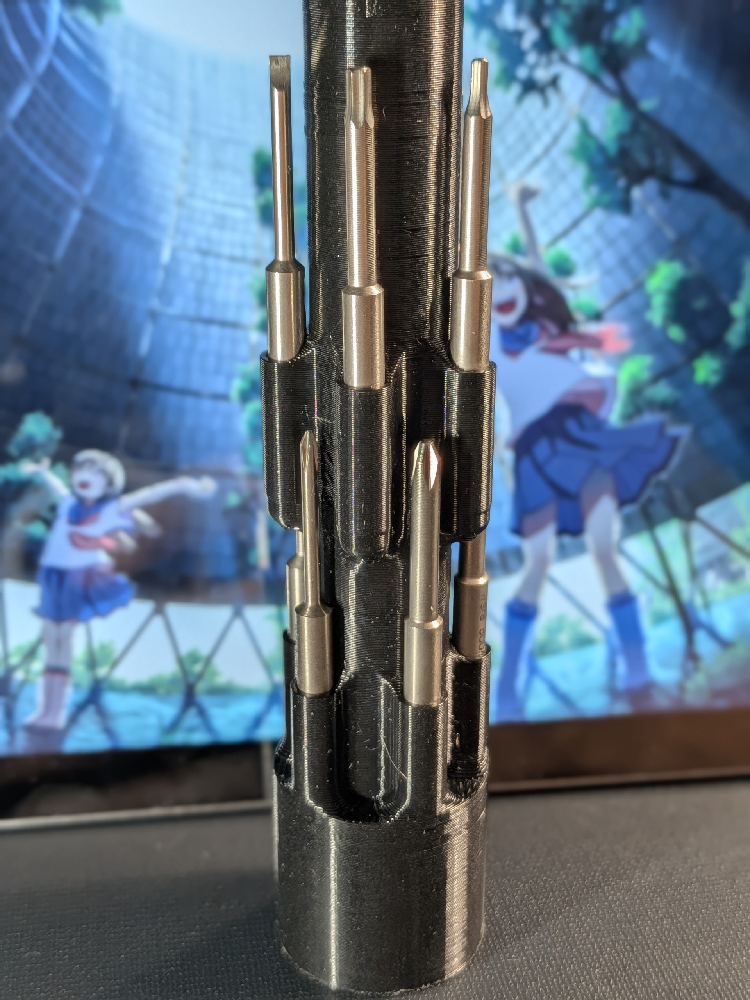

# Custom EDC Case & Bit Organizer for Wera Kraftform Micro 🧲🔧

An ultra-compact capsule case and bit organizer designed specifically for the **Wera 05135938001 Kraftform Kompakt Micro 11 Universal 1** set. Engineered from scratch for tactical everyday carry (EDC) in your pouch or pocket.

## 💡 Key Features
* **Simple Design:** The screwdriver handle hides completely inside the central channel of the bit ring, maximizing space efficiency.
* **Magnetic Bit Slots:** Bits snap perfectly into place with neodymium magnets. No plastic clips to wear down over time.
* **Magnetic Cap End:** A powerful magnet is embedded at the top of the cap. Turn it upside down on your desk to use it as a mini parts tray for loose screws (M2/M3).
* **Friction Fit:** The outer sleeve relies on the natural layer texture friction of the 3D print to stay locked securely without extra latches.

## 🛠️ Bill of Materials (BOM)
1. **Tool Set:** Wera 05135938001 Kraftform Kompakt Micro 11 Universal 1
2. **Bit Magnets:** 3x1.5 mm neodymium disc magnets (10 pcs).
3. **Top Cap Magnet:** 8x1 mm neodymium disc magnet (1 pc).
4. **Glue:** A drop of cyanoacrylate (superglue) to secure the magnets.

*Built for the field. Happy printing!*
